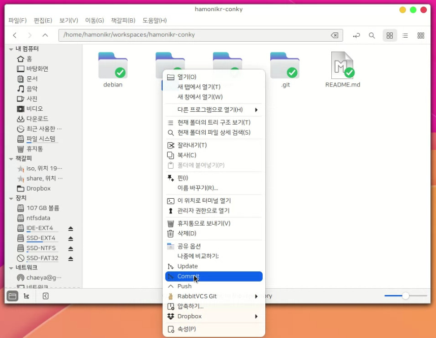
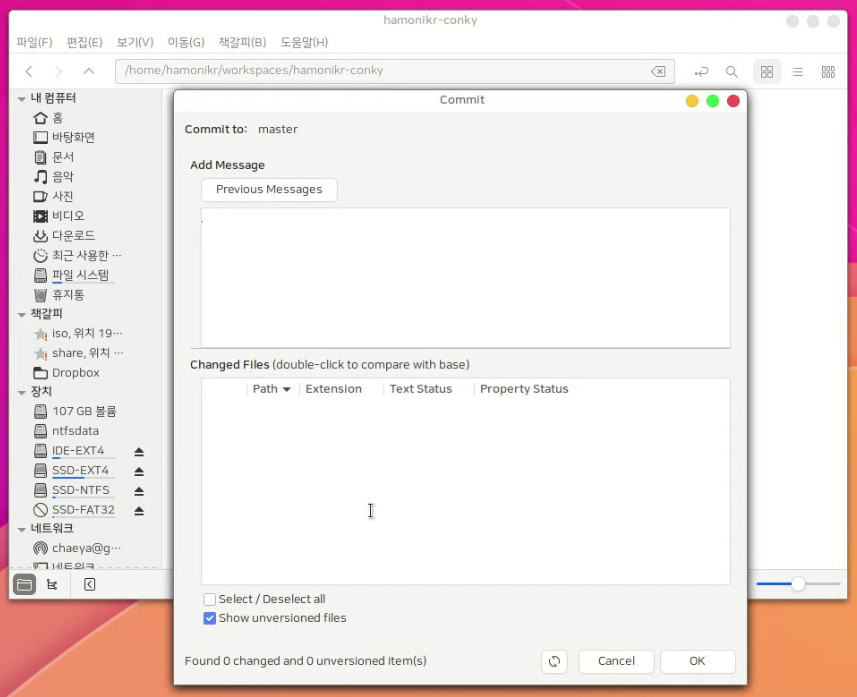

# hamonikr-nemo-rabbitvcs

하모니카 파일 탐색기에서 소스코드 버전 관리 도구를 제공하는 프로그램.

 * upstream : https://github.com/rabbitvcs/
 * related issue : https://github.com/rabbitvcs/rabbitvcs/issues/251
 




# Install

## HamoniKR 사용자의 경우
터미널을 열고(Ctrl+Alt+T) 아래 명령어를 입력하세요.

```
sudo apt update
sudo apt install -y hamonikr-nemo-rabbitvcs
```

## Ubuntu, LinuxMint 등 다른 배포판 사용자의 경우
터미널을 열고(Ctrl+Alt+T) 아래 명령어를 입력하세요.

```
curl -sL https://pkg.hamonikr.org/add-hamonikr.apt | sudo -E bash -
sudo apt install -y hamonikr-nemo-rabbitvcs
```


# Usage
 * 파일 탐색기 nemo 실행 후 마우스 오른쪽 메뉴를 누르면 프로그램 메뉴가 나옵니다.
 
 # 이슈 또는 버그
 사용 중 문제를 발견하시면 root@hamonikr.org 또는 https://groups.google.com/forum/m/#!forum/hamonikr 에서 알려주세요.
